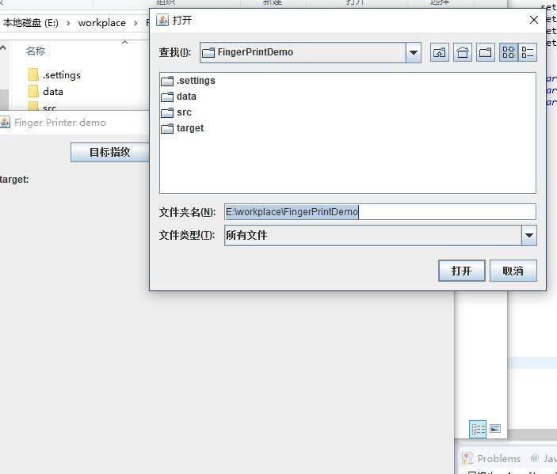

# Finger Printer Demo
>## INFO

* 基于SourceAFIS for Java SDK使用的一个指纹识别演示样例
* 有基本的图形化界面，使用的测试数据样例来源于NIST Supplemental Fingerprint Card Data (SFCD) 指纹识别数据

* IDE eclipse & maven
* Java jdk 10.0.2

>## USAGE


1. 选择指纹数据库文件夹。数据库文件夹建议的目录结构：
    ```
    database--User1--fp1.png,fp2.png
            |
            --User2--fp1.png,fp2.png
            |
            --User3--fp1.png,fp2.png
    ```
    database文件夹中以用户名（指纹所有者）命名创立文件夹，在这个子文件夹中存储对应用户（指纹所有者）的指纹。
    在确定目标数据库目录之后程序会卡顿一段时间，这段时间内程序在装载指纹数据库数据，构建数据库。

1. 选择目标指纹，需要在指纹库中尝试检索的指纹。在确定文件之后会立刻开始检索对比。

1. 检索成功，匹配指纹会出现在右侧（左侧对应的目标指纹）并弹出Username Welcome的对话框。未查找到相关记录则会弹出错误提示

